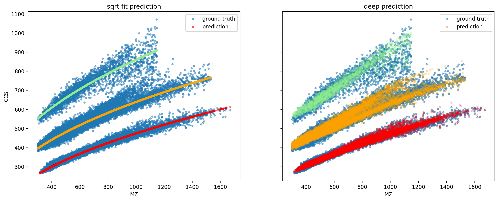
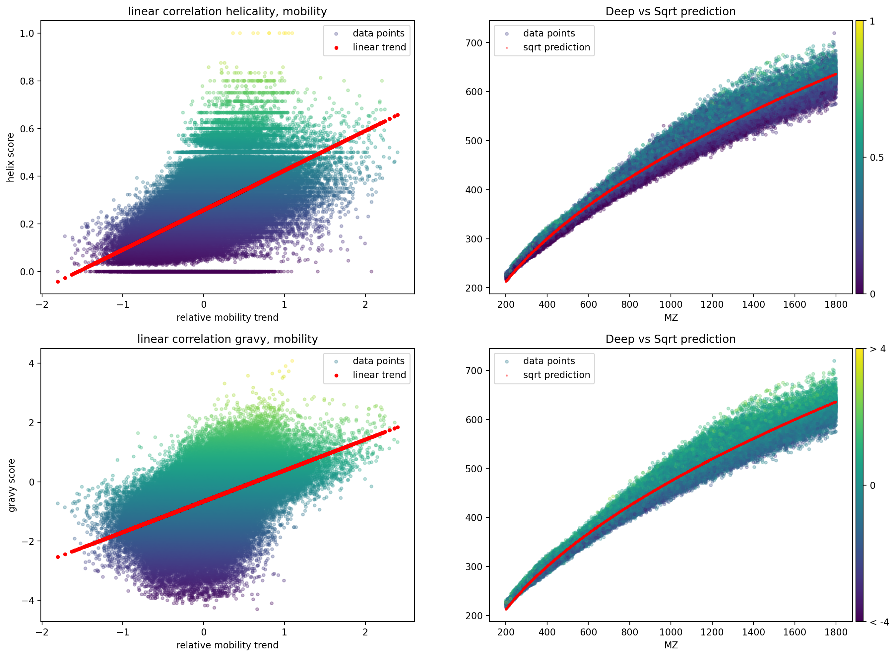
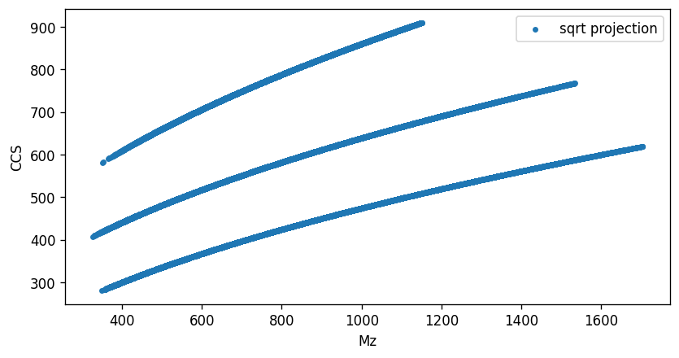

# ionmob
### A Framework for Predicting Collision Cross Section (CCS) Values of Peptide-Ions with Traditional and Deep Machine Learning Methods

`ionmob` is a Python package designed to predict **CCS** values of peptides. Beyond offering several pre-trained regression models for this task, it provides a comprehensive pipeline that seamlessly integrates data preprocessing, model training, and CCS value inference. Models are built using up-to-date versions of either [TensorFlow](https://www.tensorflow.org/) or [scikit-learn](https://scikit-learn.org/stable/).

We encourage you to use, modify, or extend ionmob to suit your needs. It's freely available and open-source under the **GNU General Public License v3.0**. Feedback is always appreciated! Please let us know if you encounter any missing features, bugs, or if you'd like to contribute in any way.

Our ionmob package is now featured in a publication in Bioinformatics. Access the fully open-access paper [here](https://academic.oup.com/bioinformatics/advance-article/doi/10.1093/bioinformatics/btad486/7237255). For those interested in replicating our experiments, training models, or reproducing result plots from the paper, additional data and scripts not included in the ionmob package can be found on [Zenodo](https://zenodo.org/record/8091540).

* [**TLDR**](#TLDR)
* [**What is a peptide CCS value?**](#what-is-a-peptide-CCS-value)
* [**Why do we measure CCS values of ions?**](#why-do-we-measure-CCS-values-of-ions)
* [**Why would I want to predict CCS values of peptides in silico?**](#why-would-I-want-to-predict-CCS-values-of-peptides-in-silico)
* [**Can I use ionmob if I am no machine learning expert?**](#can-I-use-ionmob-if-I-am-no-machine-learning-expert)
* [**What can I do with ionmob if I am an experienced coder?**](#what-can-I-do-with-ionmob-if-I-am-an-experienced-coder)
* [**Installation**](#installation)
* [**A simple example of CCS prediction and performance evaluation with pre-trained models**](#a-simple-example-of-CCS-prediction-and-performance-evaluation-with-pre-trained-models)
* [**Getting insight into driving factors of CCS**](#Getting-insight-into-driving-factors-of-CCS)
* [**Alignments of in-house and external data**](#Alignments-of-in-house-and-external-data)
* [**Implementing a custom deep CCS predictor**](#Implementing-a-custom-deep-CCS-predictor)
* [**Cite ionmob**](#Cite-ionmob)

---
### TLDR
To simply get started, load our best performing predictor and infer CCS values on a dataset
provided by this repository:

#### Inference on one of our provided datasets

```python
import tensorflow as tf
import pandas as pd
import numpy as np
from matplotlib import pyplot as plt

from ionmob.utilities.tokenization import tokenizer_from_json
from ionmob.preprocess.data import to_tf_dataset_inference

# you will need to load the correct tokenizer to translate peptide sequences to tokens
tokenizer = tokenizer_from_json('pretrained_models/tokenizers/tokenizer.json')

# load the example_data
data = pd.read_parquet('example_data/Tenzer_unimod.parquet')

# load the model
deepGRU = tf.keras.models.load_model('pretrained_models/GRUPredictor/')

# create a tensorflow dataset from example_data
tf_ds = to_tf_dataset_inference(mz=data['mz'],
                                charge=data['charge'],
                                sequences=[list(s) for s in data['sequence-tokenized']],
                                tokenizer=tokenizer)

# do inference
ccs_predicted, deep_residues = deepGRU.predict(tf_ds)
data['ccs_predicted'] = ccs_predicted
```
#### Inference on your own datasets

Inference of CCS values on custom data is already more involved as it requires you to tokenize your sequences before 
they can be used by an `ionmob` predictor. Sequences presented to `ionmob` can be composed of all 20 amino acids and a 
growing number of modifications such as phosphorylation. Have a look at all known symbols:

```python
from ionmob.utilities.chemistry import VARIANT_DICT

print(VARIANT_DICT)

{'L': ['L'], 'E': ['E'], 'S': ['S', 'S[UNIMOD:21]'], 'A': ['A'], 'V': ['V'], 'D': ['D'], 'G': ['G'],
 '<END>': ['<END>'], 'P': ['P'], '<START>': ['<START>', '<START>[UNIMOD:1]'], 'T': ['T', 'T[UNIMOD:21]'],
 'I': ['I'], 'Q': ['Q'], 'K': ['K', 'K[UNIMOD:1]'], 'N': ['N'], 'R': ['R'], 'F': ['F'], 'H': ['H'],
 'Y': ['Y', 'Y[UNIMOD:21]'], 'M': ['M', 'M[UNIMOD:35]'],
 'W': ['W'], 'C': ['C', 'C[UNIMOD:312]', 'C[UNIMOD:4]'], 'C[UNIMOD:4]': ['C', 'C[UNIMOD:312]', 'C[UNIMOD:4]']}

```

Unmodified amino acids are just written as a singe character as capital letters. Modified sequences use the 
[UniMod convention](http://www.unimod.org/): A modification is noted like `[UNIMOD:X]`, where `X` is 
the UniMod code for the respective modification. Read more about this convention [here](https://github.com/HUPO-PSI/ProForma).
Also, N termini are signified by a `<START>` token und C termini by an `<END>` token. This additionally allows for 
termini modification tokens as well as indication of read direction of peptide sequences.

Translating sequences to tokens from a given output file of PEAKS, DiaNN or MaxQuant is supported out-of-the-box:

```python
import pandas as pd
from ionmob.utilities.utility import preprocess_max_quant_sequence

mq_data = pd.read_table('path/to/mq/evidence.txt', low_memory=False)

mq_data['sequence-tokenized'] = mq_data.apply(lambda r: preprocess_max_quant_sequence(r['Modified sequence']), axis=1)
```
Depending on the software used for processing the raw-data, precursor mono-isotopic mz values might not be available
in the output files. It is therefore possible to calculate them from a given tokenized sequence and charge state:

```python
from ionmob.utilities.chemistry import calculate_mz

mq_data['mz'] = mq_data.apply(lambda r: calculate_mz(r['sequence-tokenized'], r['Charge']), axis=1)
```
Now, a dataset can be created for prediction:

```python
from ionmob.preprocess.data import to_tf_dataset_inference
from ionmob.utilities.tokenization import tokenizer_from_json

tokenizer = tokenizer_from_json('pretrained_models/tokenizers/tokenizer.json')

tf_ds = to_tf_dataset_inference(mq_data['mz'], mq_data['Charge'], mq_data['sequence-tokenized'], tokenizer)
```

#### Calculate experiment specific shifts of CCS values
A linear shift in calculated CCS values can often be observed between two experiments coming from different sources. You can correct
for this by calculating a shift factor that needs to be added to observed values. Optimally, use a set of high 
confidence identifications that contain at least tokenized sequences, charges and CCS values. They can then be used
together with one of the training datasets as reference:

```python
import pandas as pd
from ionmob.utilities.utility import get_ccs_shift

target = pd.read_table('path/to/my/table.csv')

# preprocess, select high confidence identifications, tokenize etc.

# read a reference dataset predictor was trained on
reference = pd.read_parquet('example_data/reference.parquet')

# a shift factor is calculated from charge state 2, which has the lowest variance
shift_factor = get_ccs_shift(target, reference)

# optionally, apply shift to target dataset
target['ccs_shifted'] = target.apply(lambda r: r['ccs'] + shift_factor, axis=1)
```

---
### What is a peptide CCS value?
The rotationally-averaged collision cross section - **CCS** - is a scalar value that describes a physical property of an ion.
It can be directly linked to its ion mobility, meaning its interactive behaviour with respect to a charge-neutral gas.
The ion mobility is used as an additional separating dimension in high throughput mass spectrometry.
It supplements the measurements of retention times and mass-to-charge ratios and ultimately leads to improved peptide identification.

---
### Why do we measure CCS values of ions?
The CCS value of an ion is a coarse descriptor of its 3D structure.
Since peptides are chains (strings) of amino acids, there exist permutations in nature that have exactly the same mass and chemical properties.
Differences in AA sequence will result in differences in the 3D structure though.
Distinguishing between such peptides with conventional methods like e.g. LC-MS-MS is therefore challenging.
Furthermore, post translational modifications (PTMs) might have only a small impact on an ion's mass but alter the functionality of a protein.
Since both a permutation of sequence as well as PTMs have significant impact on 3D structure, one can use ion mobility separation to distinguish between them.
CCS value calculation then gives us a measure how extensively their rotationally-averaged collision cross section differed.

---
### Why would I want to predict CCS values of peptides in silico?
First, a predictor might give you insight into factors that drive ion mobility.
This information could then be used to optimize your laboratory workflows or uncover yet unknown relationships.
Second, the high reproducibility of measured CCS values in the lab make it an ideal candidate to increase confidence in peptide identifications from database searches.
We think, the recent triumph of ion mobility enhanced mass spectrometry paves the way for expressive predictors by providing previously unavailable amounts of training data!

---
### Can I use ionmob if I am no machine learning expert?
Definitely yes!
We implemented and pretrained models of different complexity that allow for in silico prediction of CCS values for peptide ions of different charge states out-of-the-box.
They are easily integratable into your existing proteomics workflows.
All you need is a little bit of python scripting experience.
A short introduction can be found down below. 
Additionally, you can have a look at our collection of example notebooks.

---
### What can I do with ionmob if I am an experienced coder?
We made sure that our framework provides a modular set of tools for more experienced coders that want to implement their own models, training strategies or data preprocessing pipelines.
Have a look at our example notebooks for advanced workflow implementation.
Feel also free to contribute any optimizations, models or ideas that you come up with.
This will ultimately help to push prediction accuracy to a point where it provides a huge benefit for rescoring of peptide identifications!

---
### Installation
We recommend to install ```ionmob``` into a separate [python virtual environment](https://docs.python.org/3/tutorial/venv.html). Once activated, you can install the ionmob package into it as follows: 
```
git clone https://github.com/theGreatHerrLebert/ionmob.git
cd ionmob
pip install -e .
```

---
### A simple example of CCS prediction and performance evaluation with pre-trained models
Let us assume that you want to have a look at prediction performance for two different ```ionmob``` predictors on data of peptide identifications that came from some source.
For ```ionmob``` models, you should at least have the following information per peptide: **mz, charge, sequence, ccs**.
CCS values are optional in the general case but are required if you want to compare CCS predictions to CCS measurements.
We will demonstrate how to do this with one of our provided example datasets:

```python
import pandas as pd

# read example_data and a predictor
data = pd.read_parquet('example_data/Tenzer.parquet')
data.head()
```

This is what the data looks like:

|    |       mz |   charge | sequence-tokenized                                                |     ccs |      rt | name           |
|---:|---------:|---------:|:------------------------------------------------------------------|--------:|--------:|:---------------|
|  2 |  478.78  |        2 | ['\<START>' 'A' 'A' 'A' 'A' 'A' 'A' 'A' 'L' 'Q' 'A' 'K' '\<END>'] | 351.073 | 14.1374 | Tenzer-tryptic |
|  3 |  514.317 |        2 | ['<\START>' 'A' 'A' 'A' 'A' 'A' 'A' 'T' 'V' 'L' 'L' 'R' '<\END>'] | 360.949 | 38.812  | Tenzer-tryptic |
|  4 |  472.251 |        2 | ['<\START>' 'A' 'A' 'A' 'A' 'A' 'D' 'L' 'A' 'N' 'R' '<\END>']     | 320.562 | 14.467  | Tenzer-tryptic |


Let's compare accuracy for two predictors.
One that only does a zero-information square-root fit on ion mz values and a deep model that also uses information on peptide sequences.
The latter also needs a so-called [tokenizer](https://www.tensorflow.org/api_docs/python/tf/keras/preprocessing/text/Tokenizer): a tool that translates sequence symbols into a numerical representation.
It is specific for a pretrained model and therefore needs to be loaded as well:

```python
import tensorflow as tf
from matplotlib import pyplot as plt
from ionmob.preprocess.data import sqrt_model_dataset

# read the pretrained predictors
sqrtModel = tf.keras.models.load_model('pretrained_models/SqrtModel')
gruModel = tf.keras.models.load_model('pretrained_models/GRUPredictor/')

# read tokenizer for deep model
tokenizer = tokenizer_from_json('pretrained_models/tokenizer.json')

# create dataset for sqrt prediction and predict
tensorflow_ds_sqrt = sqrt_model_dataset(data.mz, data.charge, data.ccs).batch(1024)
data['ccs_predicted_s'] = sqrtModel.predict(tensorflow_ds_sqrt)

# create dataset for deep prediction and predict
tensorflow_ds_deep = get_tf_dataset(data.mz, data.charge, data.sequence, data.ccs, tokenizer,
                                    drop_sequence_ends=False, add_charge=True).batch(1024)
ccs_predicted_gru, _ = gruModel.predict(tensorflow_ds_deep)
data['ccs_predicted_g'] = ccs_predicted_gru
```

Let's compare prediction accuracies:
```python
import numpy as np

# define error functions
def mean_abs_error(ccs, ccs_pred):
    return np.round(np.mean([np.abs(x[0] - x[1]) for x in np.c_[ccs, ccs_pred]]), 2)

def mean_perc_error(ccs, ccs_pred):
    return np.round(np.mean([np.abs((x[0] - x[1]) / x[0]) * 100 for x in np.c_[ccs, ccs_pred]]), 2)

# show results
print(f"sqrt mean absolute percent error: {mean_perc_error(data.ccs, data.ccs_predicted_s)}")
print(f"gru mean absolute percent error : {mean_perc_error(data.ccs, data.ccs_predicted_g)}")
print("")
print(f"sqrt mean absolute error        : {mean_abs_error(data.ccs, data.ccs_predicted_s)}")
print(f"gru mean absolute error         : {mean_abs_error(data.ccs, data.ccs_predicted_g)}")
```

This then gives us CCS accuracies of:

```python
sqrt mean absolute percent error: 2.58
gru  mean absolute percent error: 1.84

sqrt mean absolute error        : 12.69
gru  mean absolute error        : 9.04
```

Finally, let's visualize the predictions compared to the CCS measurements:

```python
from matplotlib import pyplot as plt

# visualize the charge states in different colors
color_dict = {2:'red', 3:'orange', 4:'lightgreen'}

# create the plot
fig, (ax1, ax2) = plt.subplots(nrows=1, ncols=2, figsize=(12,4), dpi=200, sharey=True, sharex=True)

ax1.set_title('sqrt fit prediction')
ax1.set_ylabel('CCS')
ax1.set_xlabel('MZ')
ax2.set_xlabel('MZ')
ax2.set_title('deep prediction')

ax1.scatter(data.mz, data.ccs, s=10, alpha=.5, label='ground truth')
ax1.scatter(data.mz, data.ccs_predicted_s, s=10, alpha=.5, c=[color_dict[x] for x in data.charge],
            label='prediction')
ax2.scatter(data.mz, data.ccs, s=10, alpha=.5, label='ground truth')
ax2.scatter(data.mz, data.ccs_predicted_g, s=10, alpha=.2, c=[color_dict[x] for x in data.charge],
            label='prediction')
ax1.legend()
ax2.legend()
fig.show()
```

This code will result in the following plot:

<p align="center">
  
</p>

You can also try this yourself by cloning this repository and running [this notebook](/notebook/CheckAccuracy.ipynb).

---
### Getting insight into driving factors of CCS
Recent papers that worked on CCS prediction such as Chang et al.[^fn2] and Meier et al.[^fn1] identified factors that drive differences in ion mobility.
By using an in silico digest of the human proteome, we can estimate the impact of two of them, namely the [GRAVY score](https://www.bioinformatics.org/sms2/protein_gravy.html) and helicality of peptides. Our modelling approach will look like this: first an initial CCS value is calculated soley on an ions mass and charge. This is done using the simple formula below (caution, equations might be barely visible if your browser uses darkmode):


Where a slope   and an intercept  are fit separately for each modeled charge state .
The reason why ion-mobility does add an additional dimension of separation is the fact that an ion's CCS value does not always lie on that line.
If it did, CCS would be perfectly correlated with mz and therefore add no new information.
We can improve our inital CCS prediction modell by also predicting the residues with respect to the square root fit, meaning the vertical difference to our initial value.
These residues could be provided by any predictor but let's use our best performing model: the GRU-based predictor.
It uses deep [GRU-units](http://karpathy.github.io/2015/05/21/rnn-effectiveness/) that can take into account sequence specific higher-order information derived from training data.
We will expand our mathematical formulation of the problem as follows:


Here, a regressor  (GRU-units) with parameter set  was fit to further lower the mean absolut error (MAE) of predicted CCS values compared to the experimentally observed ones.
For convenience, this predictor does not only return the final predicted ccs value but also the residue with respect to the initial fit, giving us an easy way to link specific features of a given sequence to its impact on ion mobility.
An implementation with ```ionmob``` to derive this could look like this:

```python
import pandas as pd
import numpy as np
import tensorflow as tf

from ionmob.utilities.utility import get_gravy_score, get_helix_score
from ionmob.utilities.tokenization import tokenizer_from_json
from ionmob.preprocess.data import get_tf_dataset, sqrt_model_dataset

# read in silico digested human proteome to gain insight into predictors behaviour
data = pd.read_hdf('Synthetic.h5').sample(frac=0.25)

# read predictors and tokenizer
gruModel = tf.keras.models.load_model('pretrained_models/GRUPredictor/')
sqrtModel = tf.keras.models.load_model('pretrained_models/SqrtModel/')
tokenizer = tokenizer_from_json('pretrained_models/tokenizer.json')

# generate tensorflow datasets for prediction
tensorflow_ds_sqrt = sqrt_model_dataset(data.mz, data.charge, None).batch(1024)
tensorflow_ds_deep = get_tf_dataset(data.mz, data.charge, data.sequence, None, tokenizer,
                                    drop_sequence_ends=False, add_charge=True).batch(1024)

# predict with sqrt-fit
ccs_predicted_sqrt = sqrtModel.predict(tensorflow_ds_sqrt)

# predict with deep fit
ccs_predicted_gru, deep_part = gruModel.predict(tensorflow_ds_deep)

# append predictions to dataframe
data['ccs_predicted_gru'] = ccs_predicted_gru
data['ccs_predicted_sqrt'] = ccs_predicted_sqrt
data['ccs_predicted_deep'] = deep_part

# create normalized value of deep increase or decrease prediction of CCS
data['deep_normalized'] = data.ccs_predicted_deep / np.sqrt(data.mz.values)

# calculate gravy and helix scores for each sequence
gravy = [get_gravy_score(s, normalize=False) for s in data.sequence]
helix = [get_helix_score(s) for s in data.sequence]

# append calculated values to dataframe
data['gravy'] = gravy
data['helix'] = helix

# select a single charge state to deconvolce differences between charges
charge_2 = data[data['charge'] == 2]
```

We are now ready to have a look at how both GRAVY score and helix score of a given peptide are correlated with an increase or decrease of the deep predicted CCS with respect to the initial guess. Since the impact is not equal along the mz axis, the deep residue value was normalized by dividing it by the square-root mz value of its ion. We will calculate the pearson correlation to have some objective measure how strong they are correlated:

```python
from scipy.stats import pearsonr

# extract values to correlate
x = charge_2.deep_normalized.values
y_gravy = charge_2.gravy.values
y_helix = charge_2.helix.values

print('Gravy Pearson:', np.round(pearsonr(x, y_gravy), 2))
print('Helix Pearson:', np.round(pearsonr(x, y_helix), 2))
```
This gives us pearson correlation and p values for both gravy and helicality analysis:

```python
Gravy Pearson: [0.49 0.  ]
Helix Pearson: [0.52 0.  ]
```

Once again, let's visualize this to get a better feel for what the numbers are telling us:

```python
from sklearn.linear_model import LinearRegression
from mpl_toolkits.axes_grid1 import make_axes_locatable

def line(x, a, b):
    return x * a + b

reg_gravy = LinearRegression().fit(np.expand_dims(x, -1), np.expand_dims(y_gravy, -1))
reg_helix = LinearRegression().fit(np.expand_dims(x, -1), np.expand_dims(y_helix, -1))

y_line_gravy = [line(x, reg_gravy.coef_, reg_gravy.intercept_) for x in charge_2.deep_normalized.values]
y_line_helix = [line(x, reg_helix.coef_, reg_helix.intercept_) for x in charge_2.deep_normalized.values]

# create the plot
fig, ((ax1, ax2), (ax3, ax4)) = plt.subplots(nrows=2, ncols=2, figsize=(16,12), dpi=200)

ax1.set_title('linear correlation helicality, mobility')
ax1.set_ylabel('helix score')
ax1.set_xlabel('relative mobility trend')
ax2.set_xlabel('MZ')
ax2.set_title('Deep vs Sqrt prediction')

im1 = ax1.scatter(charge_2.deep_normalized, charge_2.helix, c=charge_2.helix, alpha=.3, s=10, label='example_data points')
im1 = ax1.scatter(charge_2.deep_normalized, y_line_helix, s=10, c='red', label='linear trend')

im2 = ax2.scatter(charge_2.mz, charge_2.ccs_predicted_gru, s=10, c=charge_2.helix - np.mean(data.gravy), alpha=.3, label='example_data points')
im2 = ax2.scatter(charge_2.mz, charge_2.ccs_predicted_sqrt, s=2, c='red', alpha=.3, label='sqrt prediction')
ax1.legend()
ax2.legend()

divider = make_axes_locatable(ax2)
cax = divider.append_axes('right', size='2%', pad=0.05)
cbar = fig.colorbar(im1, cax=cax, orientation='vertical', ticks=[0, 0.5, 1])
cbar.ax.set_yticklabels(['0', '0.5', '1'])

ax3.set_title('linear correlation gravy, mobility')
ax3.set_ylabel('gravy score')
ax3.set_xlabel('relative mobility trend')
ax4.set_xlabel('MZ')
ax4.set_title('Deep vs Sqrt prediction')

im3 = ax3.scatter(charge_2.deep_normalized, charge_2.gravy, c=charge_2.gravy, alpha=.3, s=10, label='example_data points')
im3 = ax3.scatter(charge_2.deep_normalized, y_line_gravy, s=10, c='red', label='linear trend')

im4 = ax4.scatter(charge_2.mz, charge_2.ccs_predicted_gru, s=10, c=charge_2.gravy, alpha=.3, label='example_data points')
im4 = ax4.scatter(charge_2.mz, charge_2.ccs_predicted_sqrt, s=2, c='red', alpha=.3, label='sqrt prediction')
ax3.legend()
ax4.legend()

divider = make_axes_locatable(ax4)
cax = divider.append_axes('right', size='2%', pad=0.05)
cbar = fig.colorbar(im3, cax=cax, orientation='vertical', ticks=[0, 0.5, 1])
cbar.ax.set_yticklabels(['< -4', '0', '> 4'])

fig.show()
```
This code then creates:

<p align="center">
  
</p>

As we can observe, our predictor is able to reproduce findings that were already postulated by Chang et al. as well as Meier et al.: Higher GRAVY and helicality values indeed lead to higher CCS values (at least with respect to our trained predictor). 
This correlation is by no means perfect, but it lies in the nature of complex interactions that lead to a peptide's 3D structure that they cannot easily be modelled by a simple set of descriptors. 
Ultimately, this is why a complex function modelling technique like Deep Learning can add something new!
Implement your own ideas to uncover driving factors like amino acid counts or specific amino acid positions by altering [this notebook](/notebook/MobilityDrivingFactors.ipynb).

---
### Alignments of in-house and external data

```python
import pandas as pd
from ionmob.preprocess import experiment as exp
from ionmob.preprocess import alignment as alig

data_dir = "example_data/raw_data/"
fname = "M210115_00[1,2,3]_HeLa_grad110_ramp100__evidence.txt"

path = data_dir + fname
df = pd.read_csv(path, sep="\t")
```

2 ways to construct an Experiment object are provided.
1st method: isolate columns needed from df (see below) as numpy arrays and pass to constructor

```python
seq, charge, ccs, intensity, mz, raw_file, evidence_id = df["Modified sequence"].values, df["Charge"].values, df[
    "CCS"].values, df["Intensity"].values, df["m/z"].values, df["Raw file"].values, df["id"].values
# give your experiment instance a name. ideally a short uinique version of fname
ex_name = "HeLa_grad110"
ex1 = exp.Experiment(ex_name, seq, charge, ccs,
                     intensity, mz, raw_file, evidence_id)
```

or rather like this. be aware of the order of args!
```python
args = df["Modified sequence"].values, df["Charge"].values, df["CCS"].values, df[
    "Intensity"].values, df["m/z"].values, df["Raw file"].values, df["id"].values
ex1 = exp.Experiment(ex_name, *args)
```

2nd method: if you are sure that the output table contains the columns "Modified sequence",
"Charge", "CCS", "Intensity", "m/z", "Raw file", "id", "Mass", "Number of isotopic peaks",
"Retention time", "Retention length" ( which is usually the case for MaxQuant evidence.txt),
then you can also use this method

```python
ex1 = exp.Experiment.from_MaxQuant_DataFrame(df, "HeLa_grad110")
```

access the name and data of Experiment like this
```python
print("name of your experiment: ", ex1.name)
print("example_data of your experiment: ", ex1.data)
```
Regardless of the initialization method the provided data is cleaned of NaN values in any of the essential columns and of the singly charged ions. 
Furthermore, the entries in the .data attribute are aggregated upon initialization of duplicate features (duplicates of sequence-charge-ccs entries), making those unique.
Additionally, entries that matched with reversed sequences of the decoy database (depicted as '+' entry in 'reverse' column) are removed.

Since the .data attribute itself is a pd.DataFrame you can use the pandas library to work on it or isolate information from
```python
ex1.data.loc[ex1.data.charge == 2]
```


to further aggregate rows and thereby getting rid of possible feature divergence, assign a modality class to each feature
```python
ex2 = ex1.assign_modalities()
```
from this point on you can proceed with the inter-experimental CCS alignment of experiment
data aquired by the same device

```python
data_dir = "example_data/raw_data/"
file_names = ["M210115_00[1,2,3]_HeLa_grad110_ramp100__evidence.txt",
              "M210115_00[4,5,6]_HeLa_grad47_ramp100__evidence.txt",
              "M210115_00[7,8,9]_HeLa_grad20_ramp100__evidence.txt"]
exp_names = ["HeLa_grad110", "HeLa_grad47", "HeLa_grad20"]
paths = [data_dir + fname for fname in file_names]
dfs = [pd.read_csv(path, sep="\t") for path in paths]
exs = [exp.Experiment.from_MaxQuant_DataFrame(
    df, exp_name) for exp_name, df in zip(exp_names, dfs)]
exs = [ex.assign_modalities() for ex in exs]

# perform the ccs alignment of the experiments to each other
aligned_exs = alig.align_experiments(exs)
# merge the aligned
aligned_ex = alig.merge_experiments(aligned_exs, "our_experiments")
```
if you want to expand your aquired data you can align a dataset aquired by another lab to the first one
first read and intrinsically align the experiments of the other dataset like you did above
```python
data_dir2 = "example_data/mann_data/"
file_names2 = ["Results_evidence_mann_Drosophila.txt",
               "Results_evidence_mann_HeLaTryp.txt",
               "Results_evidence_mann_Celegans.txt"]
exp_names2 = ["mann_Drosophila", "mann_HeLaTryp", "mann_Celegans"]
paths2 = [data_dir2 + fname for fname in file_names2]
dfs2 = [pd.read_csv(path, sep="\t") for path in paths]
exs2 = [exp.Experiment.from_MaxQuant_DataFrame(
    df, exp_name) for exp_name, df in zip(exp_names2, dfs2)]
exs2 = [ex.assign_modalities() for ex in exs2]

aligned_exs2 = alig.align_experiments(exs2)

aligned_ex2 = alig.merge_experiments(aligned_exs2, "mann_experiments")
```

in order to merge experiments from 2 different labs you firstly have to perform a linear shift on the data (in this case a copy of aligned_ex2 is returned with the additional column "shifted_ccs")
```python
aligned_ex2_mean_shifted = alig.apply_mean_shift(aligned_ex, aligned_ex2)
```
at this point you can compare the original ccs values to the shifted ones within aligned_ex2_mean_shifted by accessing aligned_ex2_mean_shifted.data.ccs and aligned_ex2_mean_shifted.data.shifted_ccs

if you are satisified with the shifted data you can proceed with adopting the shifted ccs values and then merge them with the previous method
```python
aligned_ex2_mean_shifted = alig.adopt_shifted_ccs(aligned_ex2_mean_shifted)

exs_of_labs = [aligned_ex, aligned_ex2_mean_shifted]
big_dataset = alig.merge_experiments(exs_of_labs, "our_and_mann_dataset")
```

---
### Implementing a custom deep CCS predictor
Say you come up with your very own idea for a deep CCS predictor architecture and want to build on top of ```ionmob```.
It is recomended that you have a NVIDIA CUDA enabled GPU with cuDNN bianries available in your working environment,
otherwise training may take quite some time.
We  will assume that a dataset for training was already generated, including all necesarry steps for preprocessing.
For this demonstration, we can use ```ionmob``` datasets. 
Let's use sets from different sources for training, validation and test.
This way, we make sure that we do not overestimate model performace.
We will start our model implementation by fitting a tokenizer.

```python
import pandas as pd
import numpy as np
import tensorflow as tf
import os
from datetime import datetime

import os

# suppress CUDA specific logs 
os.environ['TF_CPP_MIN_LOG_LEVEL'] = '3'

gpus = tf.config.experimental.list_physical_devices('GPU')

tf.config.experimental.set_virtual_device_configuration(gpus[0],
                                                        [tf.config.experimental.VirtualDeviceConfiguration(
                                                            memory_limit=2048)])

from matplotlib import pyplot as plt
from ionmob.alignment.experiment import Experiment

from ionmob.models.deep_models import ProjectToInitialSqrtCCS
from ionmob.preprocess.data import get_tf_dataset
from ionmob.utilities.utility import get_sqrt_slopes_and_intercepts, sequence_to_tokens, sequence_with_charge,

fit_tokenizer

data_train = pd.read_hdf('example_data/Meier.h5')
data_valid = pd.read_hdf('example_data/Tenzer.h5')
data_test = pd.read_hdf('example_data/Chang.h5')

# tokenize sequences 
seq_tokenized = [sequence_to_tokens(s, drop_ends=True) for s in data_train.sequence.values]
# fit a tokenizer
tokenizer = fit_tokenizer(seq_tokenized)
# have a look at tokens
```

The tokenizer now knows 41 tokens, 20 of which are amino acids and 21 are PTMs.

It has proven to be a very efficient way to build on top of a simple square-root fit to help a deep predictor reach high accuracy as well as fast convergence. 
```ionmob``` implements its own layer that is able to project all charge states at the same time, making it very convenient to add it to your own predictor.
It is done in two steps: First, fit slopes and intercepts for the initial prediction separately. 
Second, use the gained values to initialize a first projection layer.
```ionmob``` makes use of charge state one-hot encoding to gate the prediction based on a given charge state.
If you are interested in the intrinsics, [have a look at the implementation](https://github.com/theGreatHerrLebert/ionmob/blob/8f9378c51149d9e1df89fc4550baeebed2176a22/ionmob/models/deep_models.py#L20).

```python
slopes, intercepts = get_sqrt_slopes_and_intercepts(data_train.mz, data_train.charge, data_train.ccs)
initial_layer = ProjectToInitialSqrtCCS(slopes, intercepts)

# just make sure that everything worked by testing the projection
initial_ccs = initial_layer([np.expand_dims(data_train.mz, 1), tf.one_hot(data_train.charge - 1, 4)]).numpy()

# visualize to make sure all went as intended
plt.figure(figsize=(8, 4), dpi=120)
plt.scatter(data_train.mz, initial_ccs, s=10, label='sqrt projection')
plt.xlabel('Mz')
plt.ylabel('CCS')
plt.legend()
plt.show()
```

<p align="center">
  
</p>

The most flexible way to implement a new predictor is to subclass a [tensorflow module or keras model](https://www.tensorflow.org/guide/keras/custom_layers_and_models). 
We will do the latter, as it is the prominent way to generate new predictors for ```ionmob```. 
Let's set up a predictor that uses 1D convolutions to extract additional information from the sequence of an ion. 
All layers that should be part of the model are defined in the constructor, the execution is defined by specifying the call method.

```python
class ConvolutionalCCSPredictor(tf.keras.models.Model):
    
    def __init__(self, slopes, intercepts, num_tokens=41, seq_len=50):
        super(ConvolutionalCCSPredictor, self).__init__()
        # the inital sqrt projection
        self.initial = ProjectToInitialSqrtCCS(slopes, intercepts)
        
        # the deep sequence processor
        self.embedding = tf.keras.layers.Embedding(input_dim=num_tokens + 1, output_dim=128, input_length=seq_len)
        self.conv1d = tf.keras.layers.Conv1D(filters=32, kernel_size=8, activation='relu')
        self.mp1d = tf.keras.layers.MaxPool1D(pool_size=2)
        self.conv1d_2 = tf.keras.layers.Conv1D(filters=64, kernel_size=8, activation='relu')
        
        # the deep regression tail
        self.dense = tf.keras.layers.Dense(128, activation='relu')
        self.dropout = tf.keras.layers.Dropout(0.5)
        self.dense_2 = tf.keras.layers.Dense(64, activation='relu')
        self.out = tf.keras.layers.Dense(1, activation=None)

    def call(self, inputs):
        # read inputs
        mz, charge, sequence, _, _ = inputs
        
        # calculate sequence part
        deep = self.conv1d_2(self.mp1d(self.conv1d(self.embedding(sequence))))
        
        # concat with mz and charge
        concat = tf.keras.layers.Concatenate()([tf.keras.layers.Flatten()(deep), tf.sqrt(mz), charge])
        
        # deep regression
        dense = self.dense_2(self.dropout(self.dense(concat)))
        
        # output is sqrt-fit + deep-regression
        return self.initial([mz, charge]) + self.out(dense)
```

Callbacks are a convenient way to further automate your training procedure. 
We will use two different callbacks that observe model performance on validation data.
The first one is a learning rate reducer: Should the loss not go down after three consecutive epochs on the validation set, the reducer is going to reduce the learning rate by an order of magnitude.
If there is still no improvement on performance, the early stopper will stop the training procedure after another 2 epochs.

```python
early_stopper = tf.keras.callbacks.EarlyStopping(
    monitor='val_loss',
    patience=5
)

reduce_lr = tf.keras.callbacks.ReduceLROnPlateau(
    monitor='val_loss', 
    factor=1e-1,
    patience=2,
    monde='auto',
    min_delta=1e-5,
    cooldown=0,
    min_lr=1e-7
)

cbs = [early_stopper, reduce_lr]
```

We are now ready to instanciate our predictor, build it and then compile it with a desired objective function and optimizer. 
The model's summary tells us that it has a total of 178,785 trainable parameters.

```python
# create a recurrent predictor
model = ConvolutionalCCSPredictor(slopes, intercepts)

# set input shapes: mz, charge_one_hot, max_seq_len, helix_score, gravy_score
model.build([(None, 1), (None, 4), (None, 50), (None, 1), (None, 1)])

model.compile(loss=tf.keras.losses.MeanAbsoluteError(),
              optimizer=tf.keras.optimizers.Adam(1e-2), metrics=['mae'])

tf_train = get_tf_dataset(data_train.mz, data_train.charge, data_train.sequence, 
                          data_train.ccs, tokenizer, 
                          drop_sequence_ends=True, add_charge=False).shuffle(int(1e7)).batch(1024)

tf_valid = get_tf_dataset(data_valid.mz, data_valid.charge, data_valid.sequence, 
                          data_valid.ccs, tokenizer, 
                          drop_sequence_ends=True, add_charge=False).shuffle(int(1e7)).batch(1024)

tf_test = get_tf_dataset(data_test.mz, data_test.charge, data_test.sequence, 
                          data_test.ccs, tokenizer, drop_sequence_ends=True, add_charge=False).batch(1024)

history = model.fit(tf_train, validation_data=tf_valid, 
                    epochs=50, verbose=False, callbacks=cbs)

# plot training and validation loss 
plt.figure(figsize=(8, 4), dpi=120)
plt.plot(history.history['loss'], label='training')
plt.plot(history.history['val_loss'], label='validation')
plt.xlabel('epoch')
plt.ylabel('loss')
plt.legend()
plt.show()
```

<p align="center">
  
</p>

As we can see from the plot above, loss quickly stops to improve on validation data while it is still falling on training data. The reduction of the learning rate is clearly visible after epoch 9. We can now have a look at test performance and report our CCS prediction accuracy.

```pytho
model.evaluate(tf_test)

4/4 [==============================] - 0s 16ms/step - loss: 11.5374 - mae: 11.5374

[11.537385940551758, 11.537385940551758]
```
It is arround 11.5. Not too bad compared to the naive approach which gave us a value of arround 13. Want to try it yourself? Use [this notebook](notebook/DeepModelTraining.ipynb).

# Cite ionmob
If you use `ionmob` for your own work, we only ask you to give credit by citing:

```
@article{10.1093/bioinformatics/btad486,
    author = {Teschner, David and Gomez-Zepeda, David and Declercq, Arthur and Łącki, Mateusz K and Avci, Seymen and Bob, Konstantin and Distler, Ute and Michna, Thomas and Martens, Lennart and Tenzer, Stefan and Hildebrandt, Andreas},
    title = "{Ionmob: A Python Package for Prediction of Peptide Collisional Cross-Section Values}",
    journal = {Bioinformatics},
    pages = {btad486},
    year = {2023},
    month = {08},
    issn = {1367-4811},
    doi = {10.1093/bioinformatics/btad486},
    url = {https://doi.org/10.1093/bioinformatics/btad486},
    eprint = {https://academic.oup.com/bioinformatics/advance-article-pdf/doi/10.1093/bioinformatics/btad486/51038853/btad486.pdf},
}
```

[^fn1]: Deep learning the collisional cross-sections of the peptide universe from a million experimental values. Nat Commun, 2021. https://doi.org/10.1038/s41467-021-21352-8
[^fn2]: Sequence-Specific Model for Predicting Peptide Collision Cross Section Values in Proteomic Ion Mobility Spectrometry. Journal of Proteome Research, 2021. https://doi.org/10.1021/acs.jproteome.1c00185
